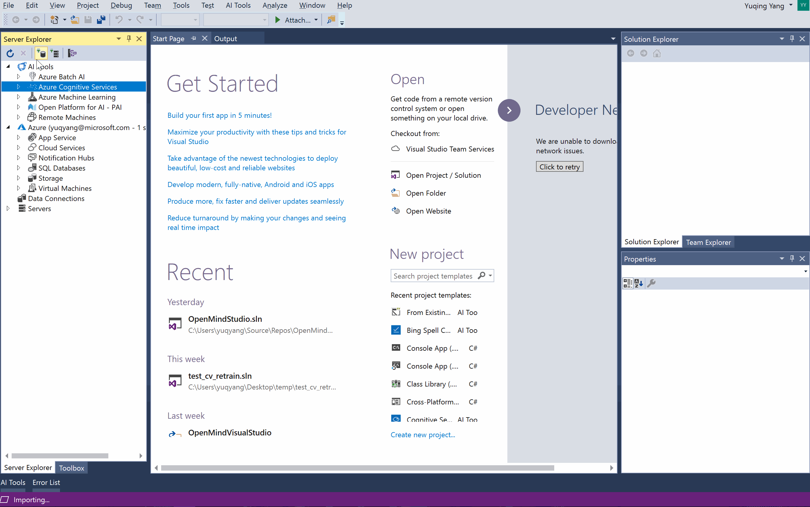

# Infuse AI into your apps with Microsoft Cognitive Services
Microsoft Cognitive Services are a set of APIs, SDKs and services available to developers to make your applications more intelligent, engaging and discoverable, with just a few lines of code.
Visual Studio Tools for AI now easily enables you to discover, create and customize your cognitive services from within Visual Studio.

## Discover and create cognitive services
By selecting the **AI Tools > Azure Cognitive Services** node on the Server Explorer panel, you could :

-	Create new cognitive services.
	Right-click the **Azure Cognitive Services** node, click **Create New Cognitive Service...** menu, and fill in the dialog accordingly.Below is the illustration of how to create new cognitive service.

	

- <a id="list-services">Discover (list) all your subscribed cognitive services</a>. Refreshing (Double clicking or right-clicking and selecting refreshing) will list all cognitive services in your subscriptions. 

	*Note: If you have many subscriptions (or resource groups) in your account, you can filter the subscriptions (and resource groups) by right clicking **Azure Cognitive Services** and selecting **Select Subscription**.* This can make finding the service you are looking for easier.

- <a id="service-properties">Query the basic information of cognitive service</a>. After listing the subscribed cognitive services, you could get further information. Right-click a service node and select **Documentation**, **Properties** or **Subscription Keys** to retrieve all information you are interested in. The subscription keys and **Endpoint Location** (**Properties**) are necessary to authenticate your applications.

## Build intelligent apps with Cognitive Services 
Visual Studio Tools for AI provides more than one way to infuse AI to your applications. You could have a try directly with an example application, or add the service's SDK to an existing .NET Frameworks project.

- Create a new application from pre-defined project templates. 
	1. Choose **File > New > Project** on the menu bar.
	2. In the **New Project** dialog, select **AI Tools > Cognitive Services**, the supported application templates will be shown.
		> [!NOTE]
		>
		> Cognitive Services .NET templates require **.NET Framework 4.6 or above**.
		> So if you are using Visual Studio 2015 and unintentionally set .NET Framework to an earlier version on the top selection box, these templates won't show at all. 
	3. After the application is created, open the source code and replace the strings such as `$Your_Subscription_Key$` and `$Your_Resource_Region$` to the correct values (Refer to [Query the basic information of cognitive service](#service-properties)).

	

- Create a new application from subscribed cognitive services.

	After [listing the cognitive services in **Tools for AI**](#list-services), right-click the service node and select **Create New Application...** menu.

- Add SDK reference to an existing .NET Framework project. 

## Retrain Custom Vision service
Customize your model in an automatable, repeatable manner by generating code which will use your own images to retrain and download your model. 

Choose to call the Custom Vision Cognitive Service in Azure or use the Core ML or TensorFlow version of your model inside your app on the edge.

