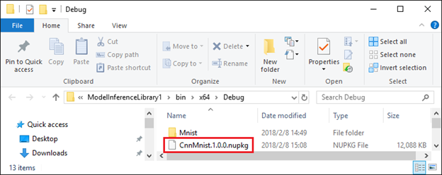

# How to add models to your application via NuGet

After [generating code from your trained model](model-inference.md), you can use Visual Studio to add a project reference to the model inferencing library project directly. Alternatively, you can publish it as a NuGet package to easily include in multiple applications or share with others in their applications like web services, desktop programs, etc. [Learn more about NuGet here](https://docs.microsoft.com/en-us/nuget/what-is-nuget)

## To create a NuGet package
Right click the Model Inference Library project node in Solution Explorer and activate the menu item named “Export to NuGet Package”.

A pop-up dialog pops up and you need provide meta information of the package to create. Please refer to [Required Metadata Elements](https://docs.microsoft.com/en-us/nuget/schema/nuspec#required-metadata-elements) in NuGet WIKI. 

Visual Studio Tools for AI will set all other configuration items of NuGet package automatically for you.

Clicking the OK button, Visual Studio Tools for AI will first build your project. If built successfully, it will generate the nuspec file and corresponding build.targets file in background. Then, the built-in nuget.exe is called to create the NuGet package of Model Inference Library project.

Finally, a Windows Resource Manager window pops up redirecting to the directory containing built NuGet package. The output path is decided by your MSBuild configuration for the project.

