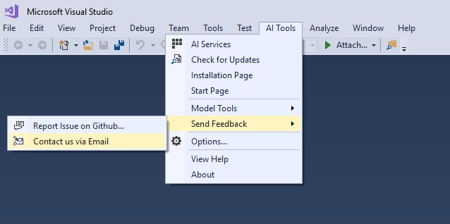
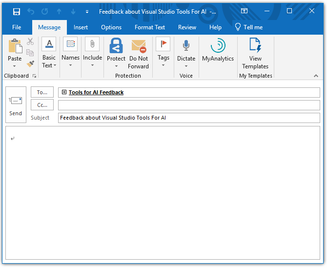
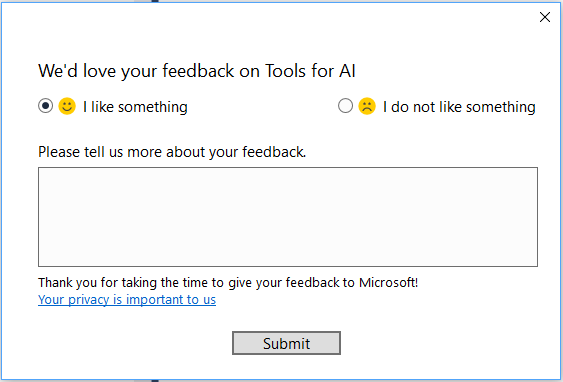

# Feedback in Visual Studio Tools for AI
If you have any issues, questions or suggestions, you have two approaches to contact us:

## GitHub
By selecting **AI Tools -> Send Feedback -> Report Issue on GitHub**, the [Visual Studio Tools for AI issues page](https://github.com/Microsoft/vs-tools-for-ai/issues) will be opened in browser for you to give feedback to us. 

##  Email
-
    By selecting **AI Tools -> Send Feedback -> Contact us via Email**, the default Email app (eg: outlook) would pop up with the **To...** and **Subject** filled.

    

    

##	Proactive Feedback Collection
-   The proactive feedback dialog would pop-up in following trigger points: 
    1. Finished creating Training/Inference/Cognitive Service Project;
    2. Convert model succeed; 
    3. On browse Job Node/Storage Node; 
    4. Submit Job succeed;
    5. Finished creating Cognitive Service;
-   The pop-up time setting is:
    1. If user close the dialog directly, remind after 7 days.
    2. Never remind the user again after submitted once.

	