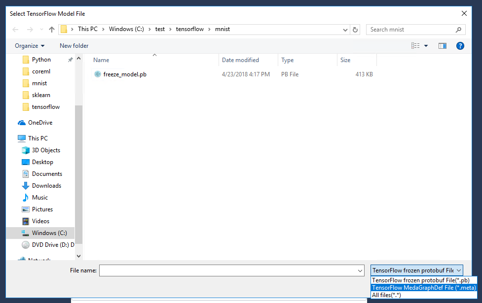
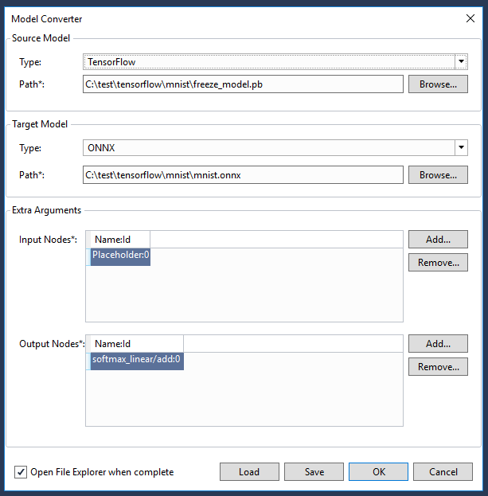
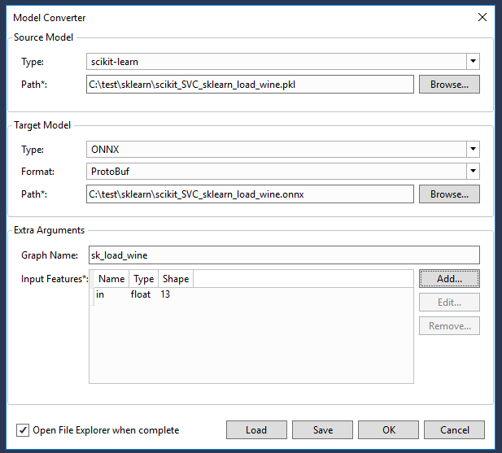
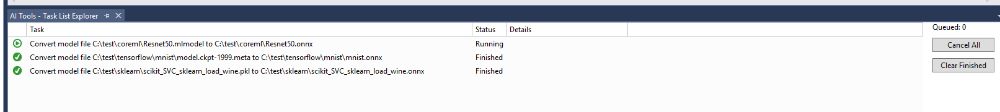

# Model Converter
You can convert machine learning and deep learning framework models to [ONNX](https://onnx.ai/). Currently, we support Core ML/TensorFlow/Scikit-Learn/XGBoost/LIBSVM.

## Prerequisites
Before converting models, go to the third-party web site to install unofficial [XGBoost](https://www.lfd.uci.edu/~gohlke/pythonlibs/#xgboost) and [LIBSVM](https://www.lfd.uci.edu/~gohlke/pythonlibs/#libsvm) 64-bit Windows packages, and then run the following command in a terminal:
```cmd
pip3 install tensorflow==1.5.0 scikit-learn onnx "git+https://github.com/apple/coremltools@v0.8" onnxmltools winmltools "git+https://github.com/onnx/tensorflow-onnx.git@r0.1"
```

## Launch Model Converter
- Launch Visual Studio and select **AI Tools > Model Tools > Convert Model...**.
- Select source model type and file.
- Select target model type(we only support ONNX currently) and file.

### Convert Core ML model
- Input graph name for ONNX model.


### Convert TensorFlow model
- We support two kinds of TensorFlow models: frozen protobuf model and MetaGraphDef model. Select checkpoint directory if model format is MetaGraphDef.


- Add input nodes and output nodes. The node name must in the graph.



### Convert Scikit-Learn/XGBoost/LIBSVM model
- Input graph name for the ONNX model.
- Add input features according to the input of the source model.



### Start Converting
- Click OK button, it will check dependencies first.
- If dependencies are all installed, a converter task will be added to task list explorer. 
- When converter task succeds, it will open a file explorer with target model selected.


