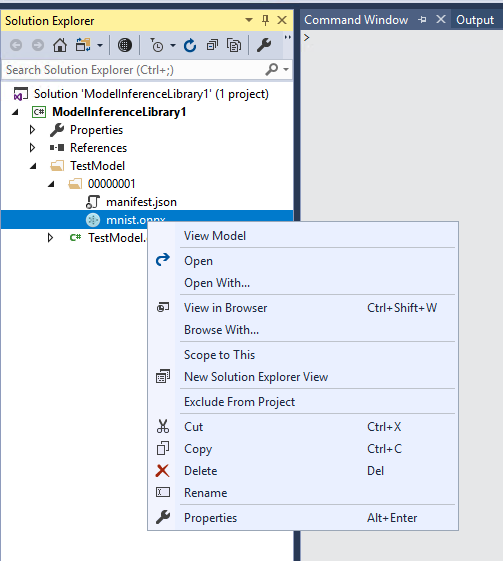

# Model Viewer
Visual Studio Tools for AI has integrated [Netron](https://github.com/lutzroeder/Netron), a viewer for neural network, deep learning and machine learning models.
The viewer supports ONNX (.onnx, .pb), Keras (.h5, .keras), Core ML (.mlmodel) and TensorFlow Lite (.tflite).
It also has experimental support for Caffe (.caffemodel), Caffe2 (predict_net.pb), MXNet (-symbol.json), TensorFlow.js (model.json, .pb) and TensorFlow (.pb, .meta).

## Prerequisites
Make sure that you have installed the latest version of Netron from its [release page](https://github.com/lutzroeder/Netron/releases).

## Launch Model Viewer
There are two entries to launch model viewer:
- Choose **AI Tools > Model Tools > View Model...** on the menu bar.
- Right-click a supported model file from model inference library project or deep learning application project in solution explorer, and then click **View Model**.

