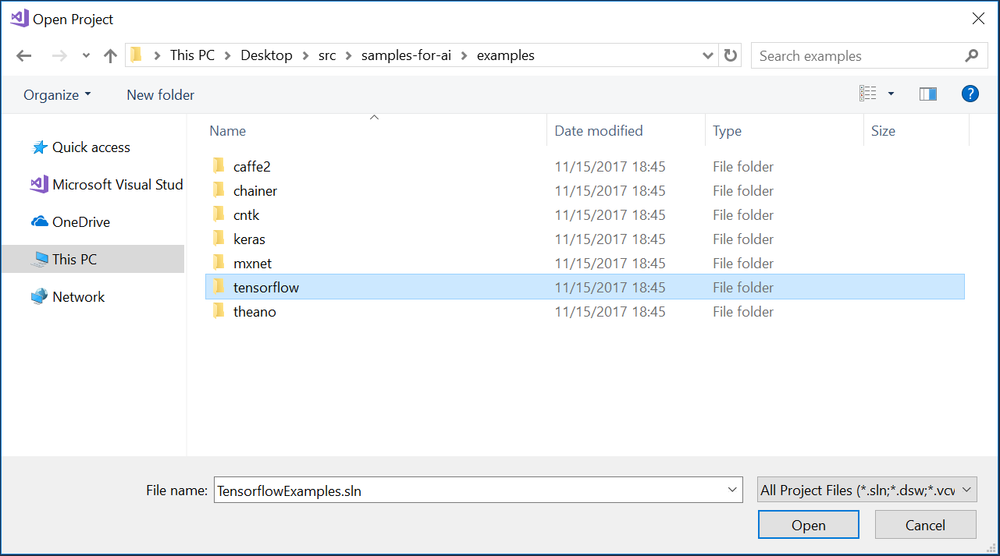

# Train a TensorFlow model locally 

In this quickstart, we will run a TensorFlow model with the [MNIST](http://yann.lecun.com/exdb/mnist/) dataset locally in AI Tools. 
The MNIST database has a training set of 60,000 examples, and a test set of 10,000 examples of handwritten digits. 

## Prerequisites

Before you begin, ensure you have the following installed:

### Google TensorFlow 

Run the following command in a terminal. 


```cmd
C:\>pip install tensorflow
```

or if you have an Nvidia GPU

```cmd
C:\>pip install tensorflow-gpu
```

### NumPy and SciPy 
run the following command in a terminal:
```cmd
pip install numpy scipy
``` 

### Download sample code
Download this [GitHub repository](https://github.com/Microsoft/samples-for-ai) containing samples for getting started with deep learning across TensorFlow, CNTK, Theano and more. 

## Open solution and train model 

- Launch Visual Studio and select **File > Open > Project/Solution**.

- Select the **Tensorflow Examples** folder from the samples repository dowloaded and open the **TensorflowExamples.sln** file. 




- Find the MNIST Project in the **Solution Explorer**, right click and select **Set as StartUp Project**.

- Click **Start**. 

- The output will be printed in the console.


> [Train a TensorFlow model in the cloud](tensorflow-vm.md)
