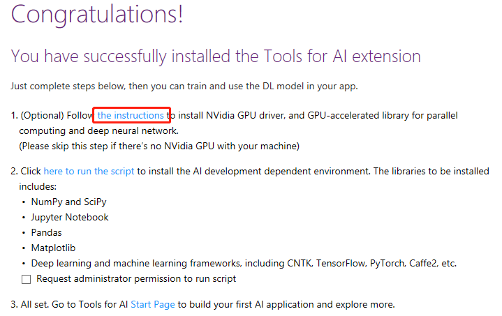
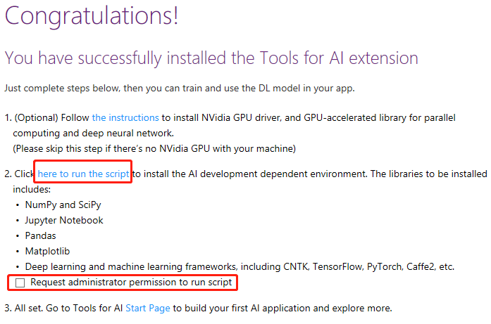
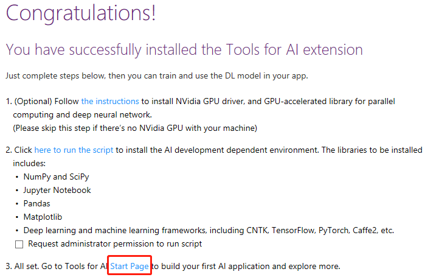

# Installation Page

By selecting the **AI Tools > Installation Page** , you could open tools for AI installation page.

- If there is a NVidia GPU in your machine, firstly you should install NVidia GPU driver and GPU-accelerated library for parallel computing and deep neural network manually. You could open the instructions by click the hyperlink "the instructions".

   

- Secondly, you could install the AI development dependent environment by click hyperlink "here to run the script" . Then, the default python.exe in your Visual Studio will be invoked to run the installation script. If your default pathon.exe is in your system directory, you should check the box to request administrator.

   

- All set. You could go to Tools for AI Start Page to build your first AI application by click hyperlink "Start Page".

    