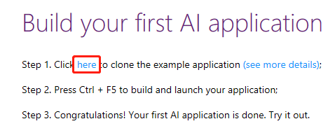
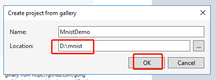
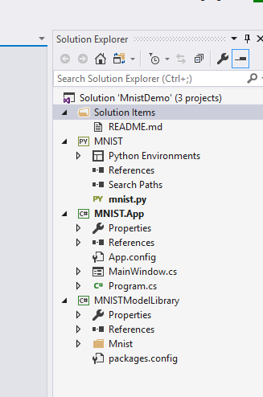
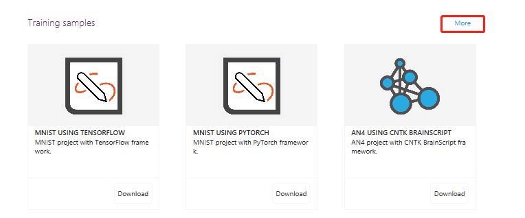
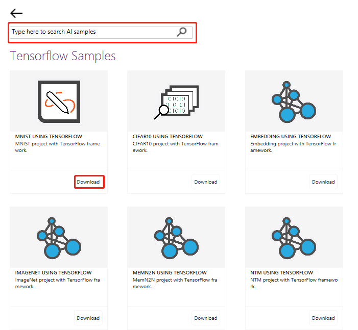
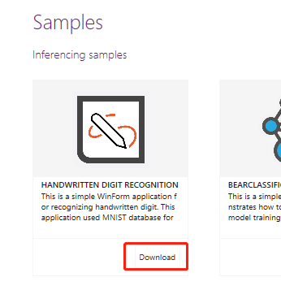

# Landing Page

Tools for AI Start Page is built to accelerate the start of building AI solution with:
- instructions to guide you to build the first AI application within 3 steps; 
- AI inferencing/training samples and AI related learning materials to quickly learn and start build your own AI solutions. 

The start page is with the start-up of Visual Studio by default for convenience. By selecting the **AI Tools > Start Page** , you could also manually open it.

## Build your first AI application

You could start to build your first AI application by clicking hyperclick "here".

   

   then a dialogue will pop up, you should choose specific local path, and click "ok" button. After downloading, A solution will be created automatically and opened in current Visual Studio window. Finally, you could build and launch your application by pressing "Ctrl + F5".

   

   
   
## Sample Gallery Page 
You could open sample Gallery page by clicking hyperlink "More".

In sample gallery page, you could search AI samples and try to build samples you like.

## Build other inferencing or training samples
  You could build other inferencing or training samples by clicking "Download" button.
 

 ## Stop opening the landing page with the start-up of Visual Studio

 You can uncheck the switch of "Open this page on next start-up" on the bottom of the page to turn off the automatic opening of landing page.