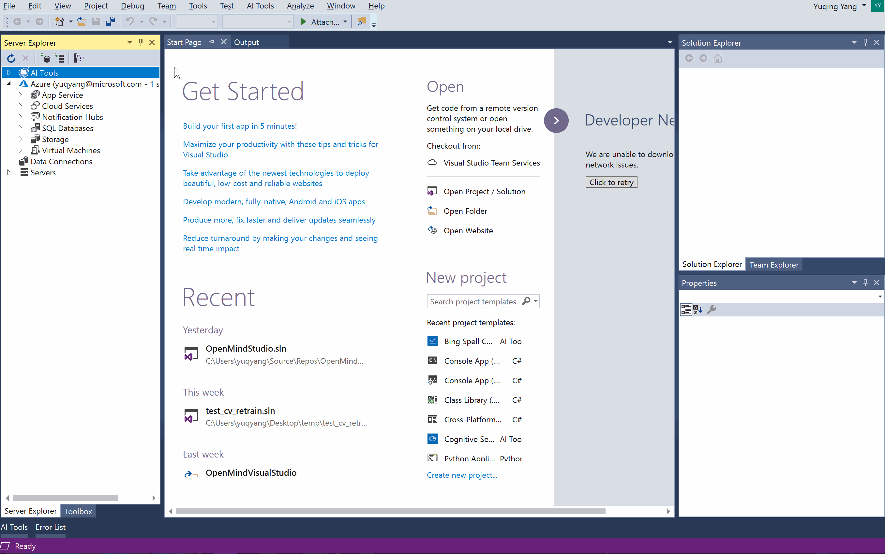
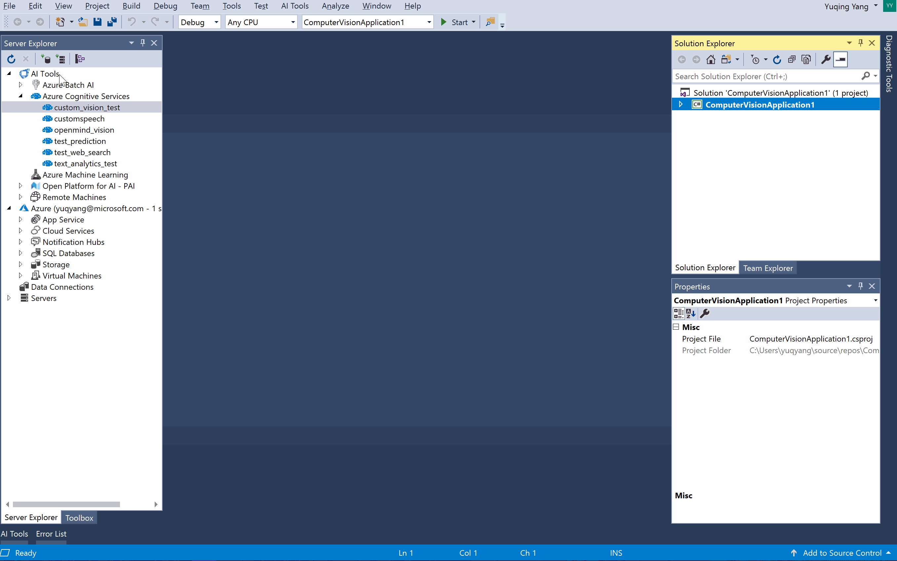

# 使用微软认知服务为应用加入人工智能

微软认知服务是一组API，SDK和服务，它能用几行代码，就帮助开发人员让应用变得更智能，又更吸引人。 Visual Studio Tools for AI能很容易的在Visual Studio中发现、创建和自定义认知服务。

## 发现并创建认知服务

在服务器资源管理器中选择**AI Tools > Azure Cognitive Services**节点，可以：

- 创建新的认知服务。 右击**Azure Cognitive Services**节点，点击**Create New Cognitive Service...** 菜单，然后在对话框中填入相应的内容。下面展示了如何创建认知服务。
    
    

- <a id="list-services">发现(列出) 订阅的所有认知服务</a>。 刷新（双击或右击并选择刷新）会列出你的订阅中的所有认知服务。
    
    *注意：如果你的账号里有多个订阅（或资源组），可右击**Azure Cognitive Services**并选择**Select Subscription**。* 这样能帮你更快找到需要的服务。

- <a id="service-properties">查询认知服务的基本信息</a>。 列出订阅的认知服务后，可以看到更多信息。 右击一个服务节点，并选择**Documentation**，**Properties** 或**Subscription Keys**来查询需要的信息。 订阅密钥和**Endpoint Location** (**Properties**) 需要认证应用。

## 用认知服务建立智能应用程序

Visual Studio Tools for AI提供了多种方法来将人工智能加入到应用程序中。 可以试试直接运行样例应用程序，或将服务的SDK添加到现有的.net项目中。

- 从预定义的项目模板中创建新应用程序。
    
    1. 在菜单栏上选择 **文件 > 新建 > 项目**。
    2. 在 **新项目** 对话框中, 选择 **AI Tools> Cognitive Services**，即可看到所有应用程序模板。
        > [!注意] 
        > 
        > 认知服务的.net模板要求安装**.NET Framework 4.6或更高版本**。 
        > 如果在使用Visual Studio 2015并不小心将上方的.NET框架选择到了较早的版本，则这些模板都不会显示出来。 
    3. 应用程序创建后，打开源代码，并将类似字符串`$Your_Subscription_Key$`和`$Your_Resource_Region$`替换为正确的值 (参考[查询认知服务的基本信息](#service-properties))。
    
    

- 从订阅的认知服务创建新的应用程序。
    
    在[列出**Tools for AI**中的认知服务](#list-services)后，右击服务节点，并选择菜单中的**Create New Application...**。

- 将SDK引用增加到现有的.NET项目中。

## 重新训练自定义视觉服务

自定义你的模型，通过生成的代码，用自己的图片来自动且可重复的方法，训练并下载模型。

通过在应用的浏览器中，选择调用Azure中的自定义视觉认知服务，或使用Core ML，TensorFlow版本。

