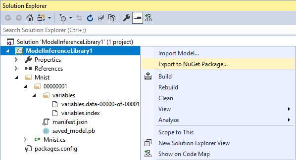
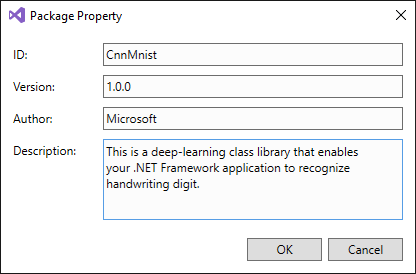

# 如何通过NuGet为应用程序添加模型

在[为训练好的模型生成代码](model-inference.md)后，可以使用Visual Studio来直接将模型的推理库增加到项目中。 或者，可以将它作为一个NuGet包发布，以便于包含到多个应用程序中，或共享给其他人的web服务，桌面程序等。 [进一步了解NuGet](https://docs.microsoft.com/en-us/nuget/what-is-nuget)

## 创建NuGet包

在解决方案资源管理器中右击模型的推理库项目节点，并点击"导出为NuGet包"。

此时会弹出一个对话框，并需要提供创建包所需要的信息。 参考NuGet WIKI的[必需的元数据信息](https://docs.microsoft.com/en-us/nuget/schema/nuspec#required-metadata-elements)。

Visual Studio Tools for AI会自动设置NuGET包的其它配置项目。

点击OK按钮后，Visual Studio Tools for AI会首先生成项目。 如果生成成功了，它会在后台生成nuspec和build.targets文件。 然后，会调用内置的nuget.exe来创建模型推理包项目的NuGet包。

最后，会弹出Windows资源管理窗口，并显示包含NuGet包的文件夹。 输出路径由此项目的MSBuild配置决定。

