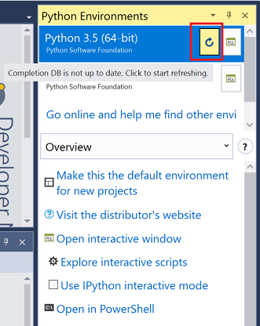

# 常见问题

## 安装Visual Studio Tools for AI

### **问题：Visual Studio Tools for AI能在Visual Studio for Mac下工作吗？**

Visual Studio Tools for AI是Visual Studio 2017 / 2015的扩展工具。 它不能在Visual Studio for Mac中运行。

### **问题：Visual Studio Tools for AI能在Visual Studio 2013中使用吗？**

Visual Studio Tools for AI只支持Visual Studio 2017和2015。

### **问题: 我从marketplace.visualstudio.com下载了VSIX文件，但为什么不能安装呢？**

Visual Studio Tools for AI在Visual Studio市场上有两个包：[VS 2017](https://marketplace.visualstudio.com/items?itemName=ms-toolsai.vstoolsai-vs2017)和[VS 2015](https://marketplace.visualstudio.com/items?itemName=ms-toolsai.vstoolsai-vs2015)。 请下载你的Visual Studio所对应的包。

简单的办法是直接从Visual Studio中安装：

- 选择菜单栏上的**工具 > 扩展和更新**，或在**快速启动**框里输入**扩展**。
- 在弹出窗口的右上角输入 **Visual Studio Tools for AI**。
- 选择**Microsoft Visual Studio Tools for AI**扩展。
- 点击**下载**按钮。

## 准备开发环境

### **问题：不能在Windows服务器操作系统中安装Python。**

将Python安装文件下载到本地目录后，右击并选择**以管理员身份运行**。 推荐将Python安装到%LocalAppData%文件夹中。


## 开发AI项目

### **问题：无法运行Python项目或样例。**

如果存在多个Python环境，Visual Studio可能会选择错误的环境作为默认值，或者项目被手动的设置成了错误的环境。 参考[设置默认Python环境](prepare-localmachine.md#setting-up-the-default-python-environment)并改变全局值，或为每个项目设置Python环境。

### **问题：无法运行CNTK BrainScript项目或样例。**

点击**AI Tools > Options > AI Tools > CNTK**并打开选项页，检查**CNTK directory**是否设置正确。 确保"${CNTK RuntimeSDK Directory}\\cntk"下有cntk.exe文件。

参考[这里](prepare-localmachine.md#microsoft-cognitive-toolkit-cntk)，了解如何安装CNTK BrainScript包。

### **问题：CNTK， TensorFlow和其它项目的智能提示不工作。 Python代码。**

安装这些框架后，Visual Studio需要一些时间来更新Python的自动完成数据库。 首先，在菜单栏选择 **工具 > Python > Python环境** (Visual Studio 2017) 或**工具 > Python 工具 > Python 环境** (Visual Studio 2015)。 然后点击刷新按钮。



### **问题：CNTK BrainScript 代码的智能提示不工作。**

当前，Visual Studio Tools for AI不支持CNTK BrainScript语言的智能提示。

## 微软认知服务

### **问题：我无法查询订阅密钥或创建应用，错误状态码为`Unauthorized`。**

在服务器资源管理器面板上右击**AI Tools > Azure Cognitive Services**，并选择**Refresh**。

### **问题: 由于发生了一个或多个错误，资源组 <xxx> 无法查询认知服务。**

在服务器资源管理器面板上右击**AI Tools > Azure Cognitive Services**，并选择**Refresh**。

### **问题：文本分析应用报告区域/位置错误。**

[TextAnalytics SDK](https://www.nuget.org/packages/Microsoft.Azure.CognitiveServices.Language/1.0.0-preview)可用的区域有：**westus**，**westeurope**，**southeastasia**，**eastus2**，**westcentralus**。 请将服务迁移（移动或重新创建）到这些位置。

### **问题：文本分析应用在控制台中无法显示中文。**

需要在**设置 > 时钟、语言和区域 > 语言**中将计算机语言改为**中文**。

### **问题: 运行自定义视觉Python应用程序时出现错误：`No module named 'azure.cognitiveservices'`。**

在终端中运行以下命令来安装自定义视觉Python SDK：

```bash
python -m pip install azure-cognitiveservices-vision-customvision
```

### **问题: 自定义视觉Python应用程序返回状态码`Bad Request`。**

这可能因为自定义视觉账户的权限问题造成的。 尝试以下步骤：

- 确保创建的自定义视觉项目（不是Visual Studio里的项目）没有超过配额。 每个服务/资源组的最大数量是由不同的价格决定的。

- 尝试另一个订阅密钥，或重新生成一个新的。