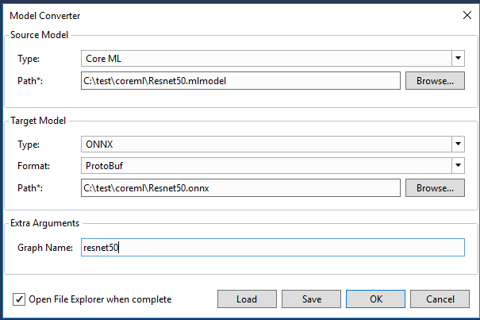

# 将模型转换为 ONNX

[ONNX](https://onnx.ai/)是表示深度学习模型的开放格式。 使用ONNX，AI开发人员能够很容易的在最先进的工具之间迁移模型，找到最合适的组合。 ONNX由社区合作伙伴开发和支持。

将模型转换为ONNX，能让它在大量的优化过的应用程序里方便的使用。 Visual Studio Tools for AI会[从ONNX和Tensorflow模型生成代码](model-inference.md)，来更方便地在应用程序中使用模型。 [Windows Machine Learning (ML)](https://docs.microsoft.com/en-us/windows/uwp/machine-learning/)仅支持ONNX模型。

通过已有的模型转换程序，Visual Studio Tools for AI能够很方便的将训练好的模型转换为ONNX。 了解更多关于[模型转换工具](https://github.com/onnx/onnx)，或使用Visual Studio的向导来创建ONNX模型。

Visual Studio Tools for AI用以下框架来将机器学习和深度学习框架的模型转换为ONNX：

- Core ML
- TensorFlow
- Scikit-Learn
- XGBoost
- LIBSVM

## 先决条件

转换XGBoost和LibSVM模型，还需要安装一些软件

- 安装[XGBoost](https://www.lfd.uci.edu/~gohlke/pythonlibs/#xgboost) 64位Windows包
- 安装[LIBSVM](https://www.lfd.uci.edu/~gohlke/pythonlibs/#libsvm) 64位Windows包

然后从命令行运行：

```cmd
pip3 install tensorflow==1.5.0 scikit-learn onnx "git+https://github.com/apple/coremltools@v0.8" onnxmltools winmltools "git+https://github.com/onnx/tensorflow-onnx.git@r0.1"
```

## 启动模型转换工具

- 在菜单栏上选择**AI Tools > Model Tools > Convert Model...**。
- 选择源模型类型和文件。
- 选择目标模型类型（当前仅支持ONNX）和文件。

### 转换Core ML模型

- 为ONNX模型输入图名称。
    
    

### 转换TensorFlow模型

可以将两种类型的TensorFlow模型转换为ONNX：

- Frozen protobuf 模型(扩展名为*.pb)
- Checkpoint MetaGraphDef 模型(扩展名为*.meta )
    
    

- 添加输入和输出节点。 图中必须写上节点名称。


### 转换Scikit-Learn/XGBoost/LIBSVM模型

- 为ONNX模型输入图名称。
- 将相应的输入特征加入到源模型中。


### 开始转换

- 点击**OK**按钮后，Visual Studio Tools for AI会首先检查依赖的软件是否安装完毕。
- 如果一切就绪，转换任务会添加到任务列表资源管理器中。 
- 转换任务成功完成后，会打开资源管理窗口并选定生成的模型文件。

