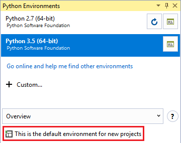
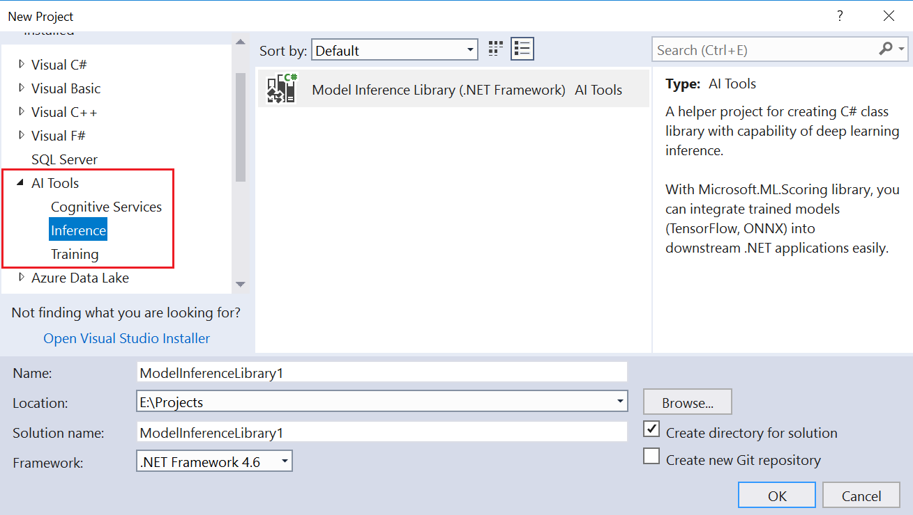
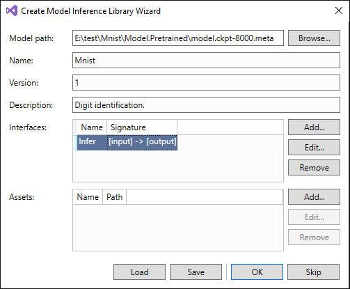
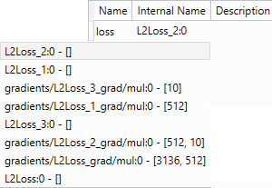

# 从训练好的模型生成代码

在Visual Studio中将预训练模型加入到应用中非常容易，就像增加其它库和资源一样。 Visual Studio Tools for AI能为训练好的模型生成代码，让它更容易使用。还包含了[Microsoft.ML.Scoring](https://www.nuget.org/packages/Microsoft.ML.Scoring/)库，它提供了面向TensorFlow和ONNX模型的一致的API。

此软件库能让用户自定优化模型，从而在推理应用中减小模型尺寸。 此外Visual Studio Tools for AI还生成了基础类来简化与模型的交互。模型推理库项目还能作为NuGet包部署，来简化发布过程。

## 支持的模型框架版本

Visual Studio Tools for AI支持应用使用TensorFlow和ONNX模型。 目前支持的版本：

- ONNX 
    - 版本: 1.0.1
    - 仅CPU (启用了Intel MKL)
- TensorFlow 
    - 版本: 1.5.0
    - 仅CPU (启用了Intel MKL)
    - 模型格式: 仅检查点和保存的模型。 不支持Frozen model。 
        - 对于TensorFlow检查点 - 包括检查点文件、元文件和数据文件都应该存放在同一个文件夹中。 如果模型包含TensorFlow的查找操作，需要将词汇表也复制到这个文件夹中。
        - 对于TensorFlow已保存的模型 - 包括pb文件，数据文件，资源文件都应该存放在同一个文件夹中。 请不要导入此软件库优化过的SavedModel文件 - 这会造成意外的错误。

> [!注意]
> 
> [Intel MKL](https://software.intel.com/en-us/mkl)在[Intel Simplified Software License](https://software.intel.com/en-us/license/intel-simplified-software-license)获得许可。

## 如何创建模型推理库项目

为了更容易的将预训练模型集成到.NET应用程序中，Visual Studio Tools for AI允许用户在原始模型文件上创建C#包装类。 它提供了对用户友好，简化并一致的API。

安装Python，在Visual Studio[设置全局默认的Python环境](prepare-localmachine.md#setting-up-the-default-python-environment)，并确保TensorFlow包安装在了默认的环境里。

首选，创建一个使用模型推理库的C#项目模板。

填上解决方案和项目名称。 点击确定按钮。

然后，弹出的'Create Model Inference Library Wizard'会帮助将一个原始的深度学习模型导入到项目中。

名称、版本和描述是模型信息中的必填字段。

- 名称：必须符合正则表达式 “^\[a-zA-Z\]\[a-zA-Z0-9_\]+$” ，因为它会被用于自动生成的模型包装的类名。
- 版本：（整数）会让ML Scoring库区分出最新的模型。
- 模型路径：保存的模型文件的路径。 对于TensorFlow，要么选择检查点的.meta文件，或者是保存的模型的.pb文件作为库，来将它用来提取真实的推理图以及参数值。
- 描述：模型所完成功能的解释性的描述。
- 启用优化：选择此复选框，会将模型简化为更小的图，从而提高推理的性能。

除了元信息外，模型输入输出的张量/操作的名称也需要明确指定。 这会告诉ML scoring库，哪个节点需要输入数据，从推理图中的哪个节点获得结果。

当选择了文件作为模型路径后，向导会分析其中包括的接口和资源文件。 如果输入的是SavedModel文件，大多数字段都可以自动填写。

最好再检查一遍从模型中自动导出的值是否正确。 如果向导不能通过分析来找到接口，可以点击接口表格边的Add按钮来增加接口来描述模型的输入输出。

在接口编辑对话框中，要填写必需的字段：

- 名称：必需符合正则表达式 “^\[a-zA-Z\]\[a-zA-Z0-9_\]+$” ，因为它会映射为包装类中的方法名。 根据C#规范，首字母应该大写。
- 输入：这是推理图中输入数据的集合，比如文本、图像和音频。 名称列是C#代码中的名字，描述是可选的。 最重要的字段是内部名称，它是输入张量或操作集的全名，会被TensorFlow或CNTK这样的训练工具包使用。
- 输出：这是推理图的节点集合，会产生分类、数值等结果。 数据列的语义与输入一致。
    
    

接口编辑器提供了自动完成功能来帮助找到正确的内部名称。 输入TensorFlow操作名称的几个字母，下拉框即会显示出来，可选择正确的操作。

填写完所有需要的字段后，点击向导中的OK按钮，Visual Studio则开始创建项目，添加ML scoring的NuGet引用，准备内容文件，生成导入模型的接口代码模板。