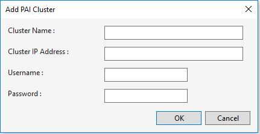
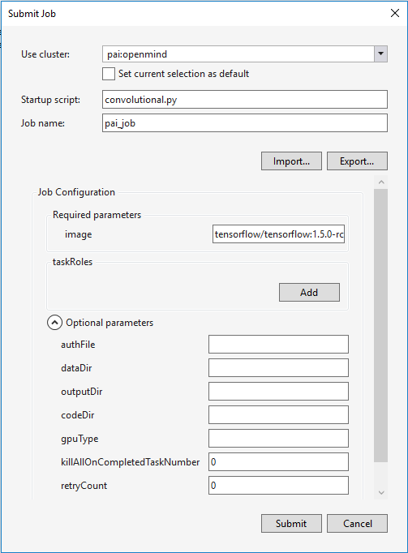
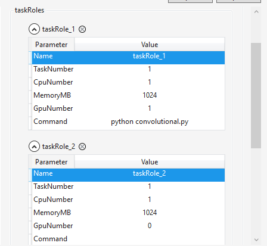
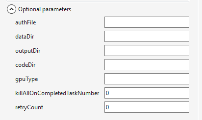

[PAI(Platform for AI)](https://github.com/Microsoft/pai)是集群管理工具和资源调度平台，由微软研究院（MSR）和微软搜索技术中心（STC）联合开发。 平台采用了在微软大规模产品环境中已被证明的成熟设计，为学术研究的场景进行了定制。

## 添加PAI集群 

要添加PAI集群，右击PAI节点，并选择"增加集群..."。 需要提供集群显示名称、IP地址、用户名和密码。

## 提交作业到PAI集群 

要提交作业到PAI集群，在解决方案资源管理器中右击项目节点，并选择"Submit Job"。

在提交窗口中：

1. 在"Cluster to use"列表中，选择目标的PAI集群。

2. "Startup script"是启动脚本相对于项目文件夹的相对路径。

3. "Job Name"是输入的作业名称，显示在集群中。 此名称必须是唯一的。

4. 必须在镜像文本框中提供docker镜像的名称，它会在docker容器中运行作业。

任务角色：

1. "name"是任务角色的名称，不能与其它任务角色相同。
2. "TaskNumber"是任务角色的任务数量，不能小于1。
3. "CpuNumber"是任务角色中每个任务的CPU数量，不能小于1。
4. "MemoryMB"是每个任务的内存（MB），不能小于100。
5. "GpuNumber"是每个任务的GPU数量，不能小于0。
6. "Command"是任务的可执行命令，不能为空。
    
    

可选参数：

1. "authFile"是HDFS上的Docker注册认证文件。 它是可选参数。

2. "dataDir"是HDFS上的数据文件夹，用来存储作业的输入数据。 它是可选参数。

3. "outputDir"是HDFS的输出文件夹，用来存储作业的输出文件。 它是可选参数。

4. "codeDir"是HDFS上的代码文件夹，用来存储训练代码文件。 它是可选参数。

5. "gpuType"指定了任务中使用的GPU类型。 如果省略此参数，作业会在所有GPU类型上运行。 它是可选参数。

6. "killAllOnCompletedTaskNumber"是完成多少个任务后，关闭掉整个作业，不能小于0。 它是可选参数。

7. "retryCount"是如果提交作业到PAI调度程序失败后，应该重试的次数，不能小于0。 它是可选参数。
    
    