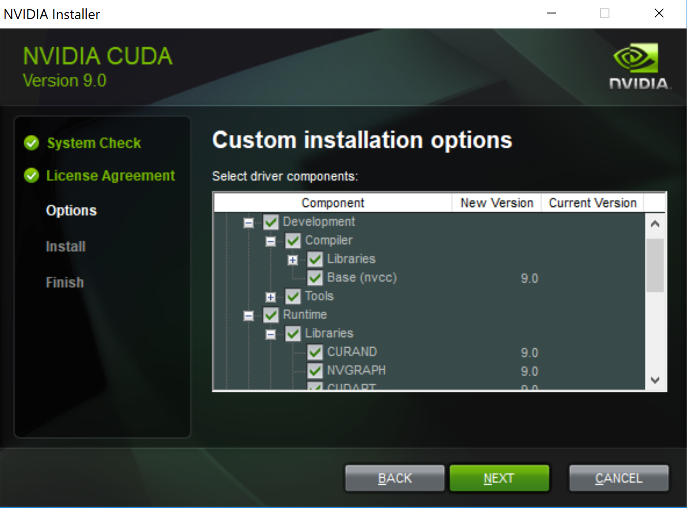
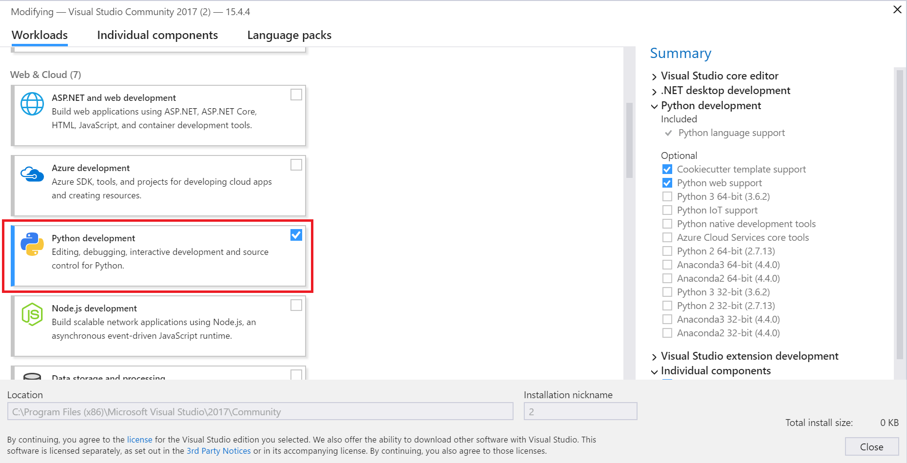
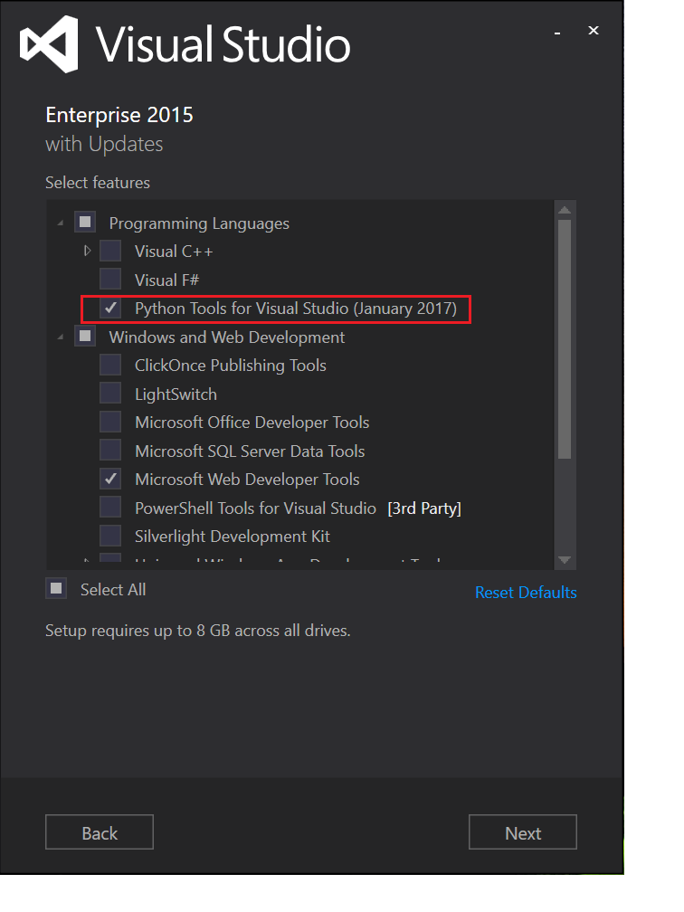
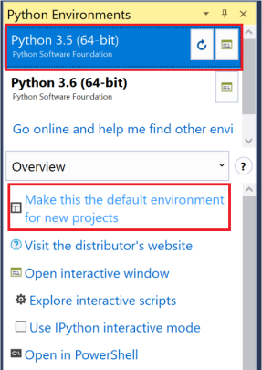

# 准备开发环境

开始在本地或远程计算机上训练深度学习模型之前，需要确保安装了最新的必要软件。 如果有NVIDIA GPU，也包括它最新的驱动和软件库。 还要确保安装了Python和必要的Python库，包括NumPy，SciPy，Python的Visual Studio/Visual Studio Code支持，以及相应的深度学习框架，例如，微软认知工具包(CNTK)，TensorFlow, PyTorch, Caffe2, MXNet, Keras, Theano和Chainer。

> [!注意]
> 
> 以下章节的软件介绍摘录于其主页。

## NVIDIA GPU驱动，CUDA和cuDNN

### NVIDIA GPU驱动

NVIDIA GPU让深度学习框架能够较快而又精确的完成学习，使其达到让人工智能能够实际应用的程度。 如果你的计算机有NVIDIA显卡，请访问[这里](http://www.nvidia.com/Download/index.aspx)或通过操作系统更新来安装最新的驱动。

### CUDA

[CUDA](https://developer.nvidia.com/cuda-zone)是NVIDIA发布的并行计算平台及编程模型。 它能够利用显卡的强大计算能力来大幅加速计算性能。 目前，CUDA工具包**9.0**是最新版深度学习框架所必需的。

安装CUDA

- 访问[网站](https://developer.nvidia.com/cuda-90-download-archive)，下载并安装CUDA。
- 确保安装了CUDA的动态链接库，并将CUDA库的路径增加到 %PATH% 或 $PATH 环境变量中。
- 在Windows上，默认路径为"C:\Program Files\NVIDIA GPU Computing Toolkit\CUDA\v9.0\bin"。



### cuDNN

[cuDNN](https://developer.nvidia.com/cudnn) (CUDA深度神经网络库) 是NVIDIA发布的用于GPU加速的深度神经网络软件库。 最新的深度学习框架需要cuDNN v6。

安装cuDNN

- 访问[这里](https://developer.nvidia.com/rdp/cudnn-archive)来为CUDA 9.0安装cuDNN v7.0.5。
- 确保cuDDN可执行文件的路径包含在了 %PATH% 或 $PATH 环境变量中。
- Windows上，可以将 cudnn64_7.dll 复制到 "C:\Program Files\NVIDIA GPU Computing Toolkit\CUDA\v9.0\bin"。

## Python

Python已经成为了深度学习应用的主要编程语言。 **64位**Python版本是必须的，推荐使用最新的[Python 3.5](https://www.python.org/downloads/release/python-354/)来获得最好的兼容性。

请将 Python 目录添加到 %PATH% 或 $PATH 环境变量中。 还需要安装**pip**包管理系统来安装和管理Python软件包。 深度学习框架依赖于pip来进行安装。

> [!注意]
> 
> 1. 在WIndows上，最好只为个人账户安装Python程序。
> 2. 如果Python软件包安装在了系统目录中（例如，Visual Studio 2017中的版本），则在运行pip时，需要管理权限才能安装Python软件包。


接下来，验证一下Python是否安装正确了，并将pip升级到最新版本。 在Python 3.5安装后，请在终端中执行以下命令：

- **Windows**

    ```cmd
    C:\>python -V
    Python 3.5.4

    C:\>pip3 -V
    pip 10.0.1 from c:\users\test\appdata\local\programs\python\python35\lib\site-packages (python 3.5)

    C:\>python -m pip install -U pip
    ```

- **macOS**

    ```bash
    MyMac:~ test$ python3 -V
    Python 3.5.4
    
    MyMac:~ test$ pip3 -V
    pip 10.0.1 from /Library/Frameworks/Python.framework/Versions/3.5/lib/python3.5/site-packages (python 3.5)
    
    MyMac:~ test$ python3 -m pip install -U pip
    ```

- **Linux**
    
    ```bash
    test@MyLinux:~$ python3 -V
    Python 3.5.4
    
    test@MyLinux:~$ pip3 -V
    pip 10.0.1 from /usr/local/lib/python3.5/dist-packages (python 3.5)
    
    test@MyLinux:~$ sudo python3 -m pip install -U pip
    ```

## 在Windows上使用Visual Studio中安装的Python

[Visual Studio](https://www.visualstudio.com/vs/)是功能完整、高效的集成开发环境，对任何开发人员，兼容所有应用和平台。

Visual Studio通过Python开发和数据科学组件（仅Visual Studio 2017）和免费的Visual Studio的Python工具扩展（Visual Studio 2015和早期版本），为Python语言提供[开源](https://github.com/Microsoft/ptvs)支持。 进一步了解，请访问[在Visual Studio中使用Python](https://docs.microsoft.com/en-us/visualstudio/python/python-in-visual-studio)。

### Visual Studio 2017

如果你是学生，开源或独立开发人员，可以下载免费的[Visual Studio Community 2017](https://www.visualstudio.com/vs/community/)版本。

Visual Studio 2017安装工具启动后，请选择**Python 开发**和**.NET 桌面开发**工作负载，从而支持Python语言和.NET。 如果想要加速深度学习模型训练或在微软Azure的[Azure Machine Learning](https://azure.microsoft.com/en-us/overview/machine-learning/)或[Azure Batch AI](https://azure.microsoft.com/en-us/services/batch-ai/)中进行推理，需要选择**Azure 开发**工作负载。

注意，64位的Python 3.6也会和Visual Studio 2017一起默认安装。 如果已经安装了Python 3.5，请参考接下来的"设置默认Python环境"章节。



### Visual Studio 2015

当Visual Studio 2015安装工具启动后，选择**自定义**类型，并选择**Visual Studio Python工具**。 如果想要加速深度学习模型训练或在微软Azure的[Azure Machine Learning](https://azure.microsoft.com/en-us/overview/machine-learning/)或[Azure Batch AI](https://azure.microsoft.com/en-us/services/batch-ai/)中进行推理，需要安装[Azure SDK](https://go.microsoft.com/fwlink/?LinkId=518003&clcid=0x409)。



### 设置默认Python环境

如果存在多个Python环境，用户需要为Visual Studio的AI项目设置默认的Python环境。 例如，用户手动安装了Python 3.5，而Visual Studio 2017 Python开发负载自动安装了64位的Python 3.6。 或者用户创建了几个Anaconda虚拟Python环境。

如果要为Visual Studio设置全局的默认Python环境，请转到菜单项**工具 > Python > Python环境**（Visual Studio 2017），或**工具 > Python工具 > Python环境**（Visual Studio 2015）。 然后，选择如**Python 3.5 (64 bit)**并点击***将此作为新项目的默认环境***按钮。



## 在Visual Studio Code中使用Python

在Visual Studio Code中，通过扩展来获得对Python的完整支持。 浏览[这里](https://code.visualstudio.com/docs/languages/python)来获得详细信息。

## 一键安装

安装深度学习和机器学习的软件及其依赖，不是一件容易的事情。 推荐使用[一键安装工具](https://github.com/Microsoft/samples-for-ai/#using-a-one-click-installer-to-setup-deep-learning-frameworks) 在Windows, macOS或Linux下自动安装。

## 基础软件包

### NumPy和SciPy

- **NumPy**是一个通用的处理数组的。它被设计用于高效的处理大的任意类型的多维数组，同时也能在处理小的多维数组时也不牺牲太多的性能。

- **SciPy** (发音为 "Sigh Pie") 是一个为数学、科学和工程设计的开源软件，它依赖于NumPy。 从版本1.0.0开始，SciPy已经为Windows提供了官方支持的wheel预编译包。

要安装 NumPy 和 SciPy，请在终端中运行以下命令：

```bash
pip3 install numpy==1.14.2 scipy==1.0.1
```

> [!注意]
> 
> 以上命令会升级旧的或非官方的 (例如，来自于 http://www.lfd.uci.edu/~gohlke/pythonlibs/ 的windows第三方包) NumPy 和 SciPy 为最新的官方版本。

### Jupyter笔记本

[Jupyter笔记本](http://jupyter.org/)是一个开源的网页应用程序，它能让你创建和共享包含可运行的代码、公式、可视化图表、文本等内容的文档。

要安装Jupyter笔记本，请在终端中运行以下命令：

```bash
pip3 install jupyter nbconvert
```

### Pandas

[Pandas](https://pandas.pydata.org/)是一个开源的，基于BSD许可的软件库，它为Python编程语言提供了高性能、易用的数据结构哦和数据分析工具。

要安装Pandas，请在终端中运行以下命令：

```bash
pip3 install pandas
```

### Matplotlib

[Matplotlib](https://matplotlib.org/)是一个能够生成出版物质量的图形的二维图表库。它有多种格式，并有跨平台的交互环境。

要安装Matplotlib，请在终端中运行以下命令：

```bash
pip3 install matplotlib
```

## 深度学习和机器学习框架

### 微软认知工具包(CNTK)

[微软认知工具包](https://cntk.ai)是一个统一的深度学习工具包，它通过直观的图形来描述神经网络的一系列可执行步骤。 CNTK支持Python和BraingScript编程语言。

要安装CNTK Python包，请阅读[如何安装CNTK](https://docs.microsoft.com/en-us/cognitive-toolkit/Setup-CNTK-on-your-machine)来获取详情。

> [!注意]
> 
> - CNTK当前不支持macOS。
> - CNTK GPU-1bit-SGD 版本由特殊的[1bit-SGD 许可](https://docs.microsoft.com/en-us/cognitive-toolkit/cntk-1bit-sgd-license)，它比CNTK主许可的限制要更严格。

简要地说，要安装CNTK Python包，在终端运行以下命令：

- 使用GPU 
    ```bash
    pip3 install cntk-gpu==2.5.1
    ```

- 不使用GPU
    ```bash
    pip3 install cntk==2.5.1
    ```

> [!注意]
> 
> 建议不要同时安装cntk和cntk-gpu包。

要安装CNTK BrainScript包，请在终端中运行以下命令：

- 访问[这里](https://github.com/Microsoft/CNTK/releases/tag/v2.5.1)下载仅CPU或GPU包。

- **Windows**
    - 解压缩zip文件到"%AppData%\Roaming\Microsoft\ToolsForAI\RuntimeSDK"。 如果文件夹不存在，请创建它。
    - 将"%AppData%\Roaming\Microsoft\ToolsForAI\RuntimeSDK\cntk\cntk"添加到 %PATH% 环境变量中。
    - 从 "%AppData%\Roaming\Microsoft\ToolsForAI\RuntimeSDK\cntk\prerequisites\MSMpiSetup.exe" 安装Microsoft MPI。它是CNTK必需的组件。
    - 如果还没有安装Microsoft Visual C++ 2015分发包，可以从 "%AppData%\Roaming\Microsoft\ToolsForAI\RuntimeSDK\cntk\prerequisites\VS2015\vc_redist.x64.exe" 安装。

- **Linux**
    - 将zip文件解压缩到Home目录 "~/.toolsforai" 下。
    - 将 "~/.toolsforai/cntk/cntk/bin" 添加到 $PATH 环境变量中。
    - 运行以下命令安装 OpenMPI： 
        ```bash
        sudo apt-get install libopenmpi-dev
        ```

### TensorFlow

[TensorFlow](https://www.tensorflow.org/)采用数据流图形，为数值计算提供的一个开源软件库。 请参考[这里](https://www.tensorflow.org/install/)来了解安装详情。

要安装TensorFlow，在终端中运行以下命令：

- 使用GPU 
    ```bash
    pip3 install tensorflow-gpu==1.5.0
    ```

- 不使用GPU 
    ```bash
    pip3 install tensorflow==1.5.0
    ```

### PyTorch

[PyTorch](http://pytorch.org/)是一个提供两个高级功能的Python包：

- Tensor computation (like numpy) with strong GPU acceleration
- Deep Neural Networks built on a tape-based autograd system

要安装PyTorch，在终端中运行以下命令：

- **Windows**
    
    - 使用GPU
        ```bash 
        - Python 3.5
            pip3 install http://download.pytorch.org/whl/cu90/torch-0.4.0-cp35-cp35m-win_amd64.whl
        - Python 3.6
            pip3 install http://download.pytorch.org/whl/cu90/torch-0.4.0-cp36-cp36m-win_amd64.whl
        ```
    - 不使用GPU
        ```bash 
        - Python 3.5
            pip3 install http://download.pytorch.org/whl/cpu/torch-0.4.0-cp35-cp35m-win_amd64.whl
        - Python 3.6
            pip3 install ttp://download.pytorch.org/whl/cpu/torch-0.4.0-cp36-cp36m-win_amd64.whl
        ```

- **macOS**
    
    ```bash
    pip3 install torch==0.4.0
    ```

    > [!注意]
    > 
    > macOS库不支持CUDA，如果需要CUDA，则需要从源代码编译安装

- **Linux**
    
    - 使用GPU
        ```bash 
        - Python 3.5
            pip3 install http://download.pytorch.org/whl/cu90/torch-0.4.0-cp35-cp35m-linux_x86_64.whl
        - Python 3.6
            pip3 install http://download.pytorch.org/whl/cu90/torch-0.4.0-cp36-cp36m-linux_x86_64.whl
        ```
    - 不使用GPU
        ```bash 
        - Python 3.5
            pip3 install http://download.pytorch.org/whl/cpu/torch-0.4.0-cp35-cp35m-linux_x86_64.whl
        - Python 3.6
            pip3 install http://download.pytorch.org/whl/cpu/torch-0.4.0-cp36-cp36m-linux_x86_64.whl
        ```

最后，安装torchvision：

```bash
pip3 install torchvision
```

### Caffe2

[Caffe2](https://caffe2.ai/)是一个轻量级，模块化，可伸缩的深度学习框架。 基于原始的Caffe，Caffe2被设计为支持表达式、高速度、和模块化。

当前，没有官方预编译的Caffe2 Python wheel包。 请访问[这里](https://caffe2.ai/docs/getting-started.html)来从源代码生成。

> [!注意] [此站点](https://github.com/linmajia/ai-package/tree/master/caffe2/0.8.1)有第三方的Caffe2 0.8.1 Windows下的wheel安装包(同时支持GPU和CPU)。

### MXNet

[Apache MXNet (开发中)](https://mxnet.incubator.apache.org/)是一个为效率和灵活性设计的深度学习框架。 它能混合[符号和命令式编程](http://mxnet.io/architecture/index.html#deep-learning-system-design-concepts)，从而最大化效率和生产力。

要安装MXNet，请在终端中运行以下命令：

- 使用GPU 
    ```bash
    pip3 install mxnet-cu90==1.1.0.post0
    ```

- 不使用GPU 
    ```bash
    pip3 install mxnet==1.1.0.post0
    ```

### Keras

[Keras](https://keras.io/)提供了高级的神经网络API，它完全由Python写成，基于CNTK， TensorFlow或Theano。它的宗旨是聚焦于如何加快试验过程。 要想做好研究，必须用最快的速度将想法变为结果。

要安装Keras，在终端中运行以下命令：

```bash
pip3 install Keras==2.1.5
```

### Theano

[Theano](http://deeplearning.net/software/theano/)是一个能够高效的定义、优化、计算多维数学表达式的Python库。

要安装Theano，在终端中运行以下命令：

```bash
pip3 install Theano==1.0.1
```

### Chainer

[Chainer](https://chainer.org/)是一个灵活的基于Python的深度学习框架。 它基于**执行时决定方法** （又叫做动态计算图） 提供了自动化微分的API，还有面对对象的高级API来生成和训练神经网络。

要支持CUDA，需要安装[CuPy](https://github.com/cupy/cupy)：

```bash
pip3 install cupy==4.0.0
```

> [!注意]
> 
> 在Windows上，你需要**2015**版的[Microsoft Visual Studio](https://www.visualstudio.com/) 或者[Microsoft Visual C++ Build Tools](http://landinghub.visualstudio.com/visual-cpp-build-tools) 来编译基于CUDA 8.0的CuPy。 首先，打开一个**VS2015 x64 Native Tools命令提示符**或**Visual C++ 2015 x64 Native Tools命令提示符**，并执行上面的cupy安装命令。

要安装Chainer，在终端中运行以下命令：

```bash
pip3 install chainer==4.0.0
```

要启用多节点分布式的深度学习，请在终端安装 [ChainerMN](https://github.com/chainer/chainermn)：

```bash
pip3 install chainermn
```

### scikit-learn

[scikit-learn](scikit-learn.org)是基于SciPy的Python机器学习包，它通过3-Clause BSD许可分发。

要安装scikit-learn，在终端中运行以下命令：

```bash
pip3 install scikit-learn==0.19.1
```

### XGBoost

[XGBoost](https://github.com/dmlc/xgboost)是优化的分布式梯度渐变库，它的设计目标是高效、灵活、可移动。 它在梯度渐变框架下实现了机器学习算法。

要安装XGBoost，在终端中运行以下命令：

- **Windows** 目前还没有官方的Windows预生成wheel包。 访问[这里](https://www.lfd.uci.edu/~gohlke/pythonlibs/#xgboost)，并下载合适的64位包。 
    ```bash
    pip3 install /download/path/xgboost*win_amd64.whl
    ```

- **非Windows** 
    ```bash
    pip3 install xgboost
    ```

### LIBSVM

[LIBSVM](https://www.csie.ntu.edu.tw/~cjlin/libsvm/)是一个集成的软件，包括支持向量分类，（C-SVC, nu-SVC），回归（epsilon-SVR, nu-SVR）和分布式预测(one-class SVM)。 它支持多类别的分类。

要在Windows上安装LIBSVM，访问[这里](https://www.lfd.uci.edu/~gohlke/pythonlibs/#libsvm)并下载合适的64位包。目前还没有官方的Windows预生成wheel包。 然后，在终端中运行以下命令：

```bash
pip3 install /download/path/libsvm*win_amd64.whl
```

要在非Windows平台上安装LIBSVM，需要从[源代码](https://github.com/cjlin1/libsvm/releases)生成。

## 模型管理软件包

### 开放神经网络交换标准 (ONNX)

[ONNX](http://onnx.ai/)是迈向开放生态系统的第一步，它赋予AI开发人员根据自己的项目选择正确工具的能力。 ONNX为AI模型提供了开源的格式。 Caffe2, PyTorch, 微软认知工具包, Apache MXNet和其它工具都在开发ONNX支持。

> [!注意]
> 
> 在非Windows平台，需要先安装[Protobuf](https://github.com/google/protobuf/releases)编译器，并为onnx-ml设置环境变量ONNX_ML=1。

要安装ONNX，在终端中运行以下命令：

```bash
pip3 install onnx
```

### Core ML社区工具 (coremltools)

[coremltools](https://github.com/apple/coremltools)包含了所有用于CoreML模型的转换和验证工具。 它包括Scikit Learn (0.17+), LIBSVM, Caffe, Keras (1.2.2, 2.0.4+) 和XGBoost (0.7+)。 框架安装好后，才能转换对应的模型。

要安装coremltools，在终端中运行以下命令：

- **Windows** > [!注意] > 目前还没有官方的Windows预生成wheel包。 下面的方法仅安装 Python 包。 
    ```bash
    pip3 install "git+https://github.com/apple/coremltools@v0.8"
    ```

- **非Windows** 
    ```bash
    pip3 install coremltools
    ```

### ONNX ML 工具 (onnxmltools)

[onnxmltools](https://github.com/onnx/onnxmltools)能够将各种不同而的机器学习工具包中的模型转换为ONNX。 当前支持下列工具包（需要安装）：

- Apple Core ML
- scikit-learn (转换模型到ONNX的子集)

要安装onnxmltools，在终端中运行以下命令：

```bash
pip3 install onnxmltools
```

### Microsoft ML 工具 (winmltools)

[winmltools](https://pypi.python.org/pypi/winmltools)能将不同的机器学习工具包中的模型转换为用于Windows机器学习的ONNX。

要安装winmltools，在终端中运行以下命令：

```bash
pip3 install winmltools
```

### tf2onnx

[tf2onnx](https://github.com/onnx/tensorflow-onnx)将TensorFlow图转换为ONNX图。 tf2onnx是早期开发版。 TensorFlow比当前ONNX版本支持的操作多大约4倍。 但ONNX支持标准模型使用的大多数操作。

要安装tf2onnx，在终端中运行以下命令：

```bash
pip3 install "git+https://github.com/onnx/tensorflow-onnx.git@r0.1"
```

### Netron

[Netron](https://github.com/lutzroeder/Netron)是神经网络，深度学习和机器学习模型的查看工具。

Netron 支持 ONNX (.onnx, .pb), Keras (.h5, .keras), CoreML (.mlmodel) 和TensorFlow Lite (.tflite). Netron对 Caffe (.caffemodel), Caffe2 (predict_net.pb), MXNet (-symbol.json), TensorFlow.js (model.json, .pb) 和 TensorFlow (.pb, .meta) 也有部分支持。

要安装Netron，访问[发布页](https://github.com/lutzroeder/Netron/releases)并下载合适的安装包。

## 通过模型文件转换来实现ML/DL框架间的互操作。

近年来，机器学习和深度学习在IT业界得到了普及。 产生了大量的框架来让用户构建自己的模型。 但是，它们在实现细节上有很多差异。 这样的结果是，一个框架生成的模型不能在接下来的另一个框架下重用，进行下一步的训练或推理。这给用户在框架选择上带来了不便和成本。

模型文件转换工具是应对这类挑战的可行的尝试。 在上面的子章节中，介绍了几个模型转换工具：coremltools, onnxmltools, winmltools 和tf2onnx, 以及它们的安装方法。

对于Windows用户，推荐使用[一键安装工具](https://github.com/Microsoft/samples-for-ai/#using-a-one-click-installer-to-setup-deep-learning-frameworks)来安装这些转换工具。 如果希望自己安装软件，首先访问第三方网站安装非官方的[XGBoost](https://www.lfd.uci.edu/~gohlke/pythonlibs/#xgboost)和[LIBSVM](https://www.lfd.uci.edu/~gohlke/pythonlibs/#libsvm)64位包，然后在终端中运行下列命令：

```bash
pip3 install tensorflow==1.5.0 scikit-learn onnx "git+https://github.com/apple/coremltools@v0.8" onnxmltools winmltools "git+https://github.com/onnx/tensorflow-onnx.git@r0.1"
```