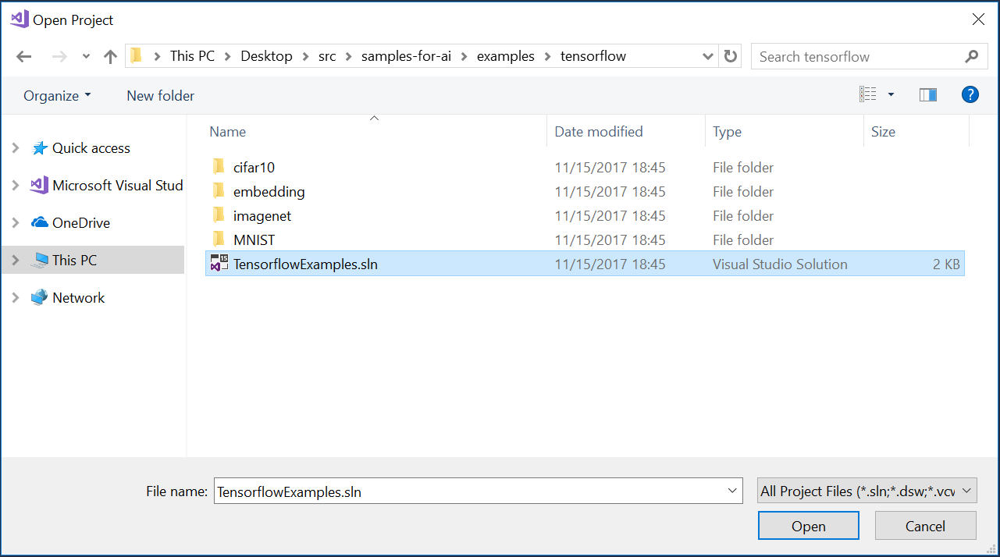
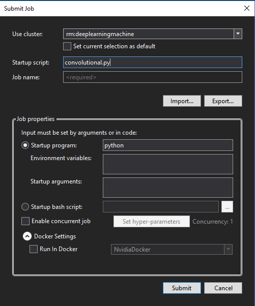
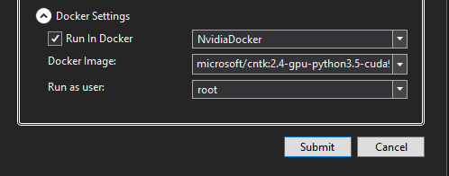

# 在云端训练TensorFlow模型

在本教程中，会使用[MNIST数据集](http://yann.lecun.com/exdb/mnist/)在Azure的[深度学习虚拟机](https://docs.microsoft.com/azure/machine-learning/data-science-virtual-machine/deep-learning-dsvm-overview)中训练TensorFlow模型。

MNIST手写体数字数据库中有60,000个样本的训练集，和10,000个样本的测试集。

## 先决条件

开始前，确保进行了如下安装和配置：

### 下载示例代码

下载[GitHub代码库](https://github.com/Microsoft/samples-for-ai)，它包含有TensorFlow，CNTK，Theano和其它深度学习库的示例。

### 配置Azure 深度学习虚拟机

请阅读[设置深度学习虚拟机](https://docs.microsoft.com/azure/machine-learning/data-science-virtual-machine/provision-deep-learning-dsvm)。

> [!注意] 将**Location**设置为US West 2 (或其它有Deep Learning虚拟机的区域) 并将**OS type** 设置为Linux。

### 更新 .bashrc 文件来启用通过非交互式的Bash会话来提交远程作业

用Putty或其它ssh工具登录到深度学习虚拟机上。 执行下列语句来启用远程深度学习作业提交（即，远程通过脚本提交到虚拟机中）。

```bash
echo -e ". /etc/profile\n$(cat ~/.bashrc)" > ~/.bashrc
```

## 打开项目

- 运行Visual Studio 并选择**文件 > 打开 > 项目/解决方案**。

- 从下载的样例库中选择 **examples\tensorflow** 文件夹。


- 打开**TensorflowExamples.sln**文件。



## 添加Azure远程虚拟机

在服务器资源管理器中，右击AI Tools节点下的**Remote Machines**节点，并选择"Add..."。 输入远程机器的显示名，IP地址，SSH端口，用户名，以及密码或密钥文件。


## 提交作业到Azure虚拟机

在**解决方案资源管理器**中右击MNIST项目，并选择**Submit Job**。



在提交窗口中：

- 在**Cluster to use**列表中，选择远程机器 (以"rm:"开头) 来提交任务。

- 输入一个**job name**.

- 点击**Submit**。



也可以将作业提交到Docker容器中运行：

- 选择'Run In Docker'复选框

- 选择运行Docker容器的命令："Docker" or ["NvidiaDocker"](https://github.com/NVIDIA/nvidia-docker)

- 在"Docker image"中选择Docker镜像，或输入在Docker中心里自定义的镜像。 默认docker注册于[Docker Hub](https://hub.docker.com/)

- 选择在远程机器运行Docker容器的用户。 默认用户是"root"。

## 检查作业状态

要查看任务状态和详细信息：在**服务器资源管理器**中展开到提交任务的虚拟机。 双击**Jobs**。


## 释放资源（可选）

如果暂时不需要一台虚拟机，可以停止它。 如果完成了本教程，运行下列命令来释放资源：

```azure-interactive
az group delete --name myResourceGroup
```